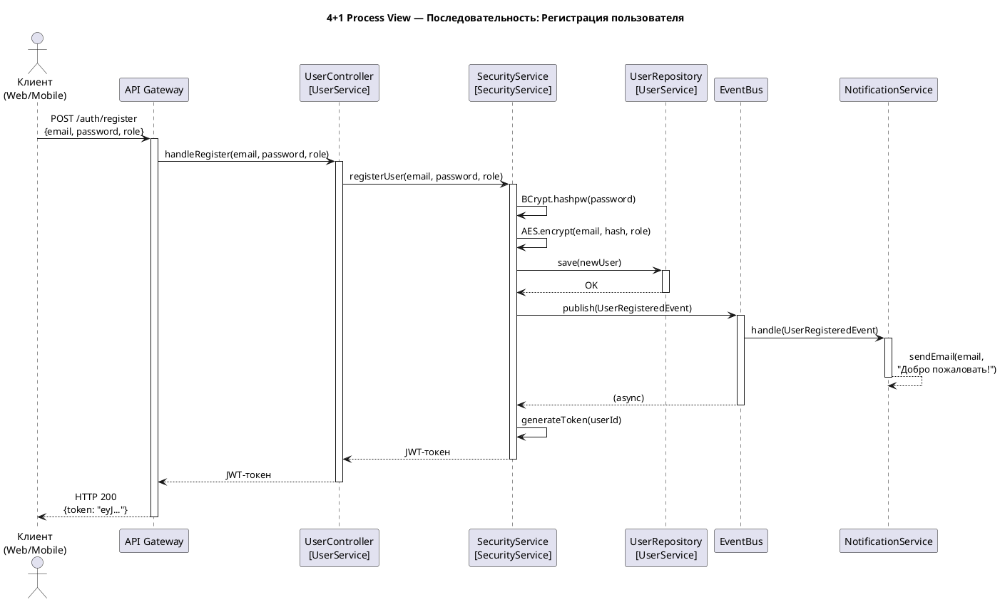
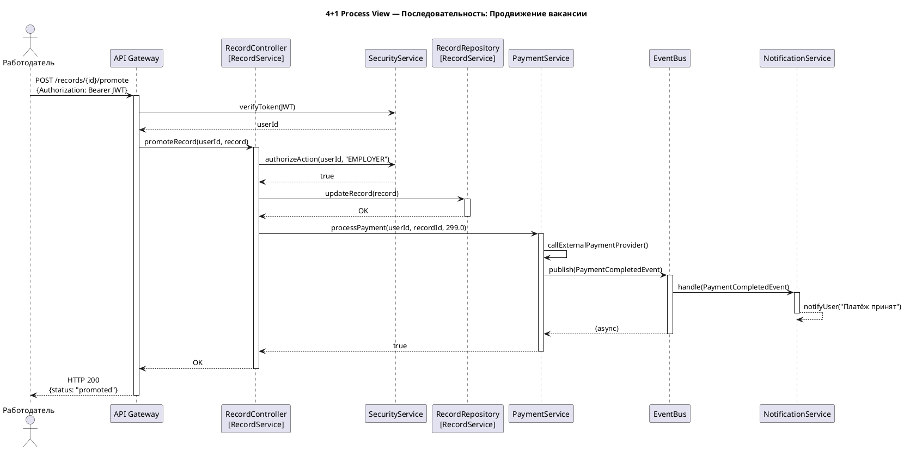
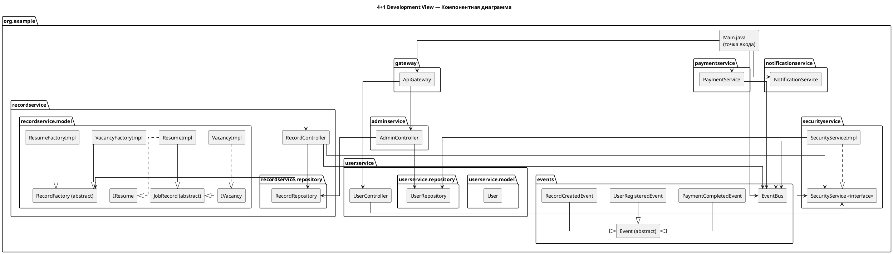
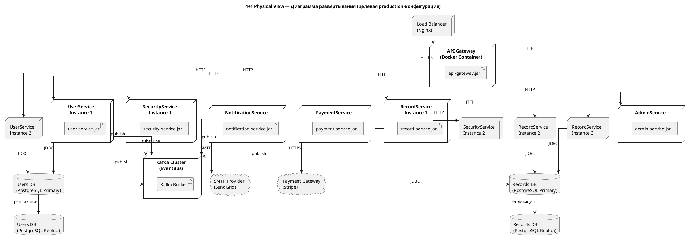
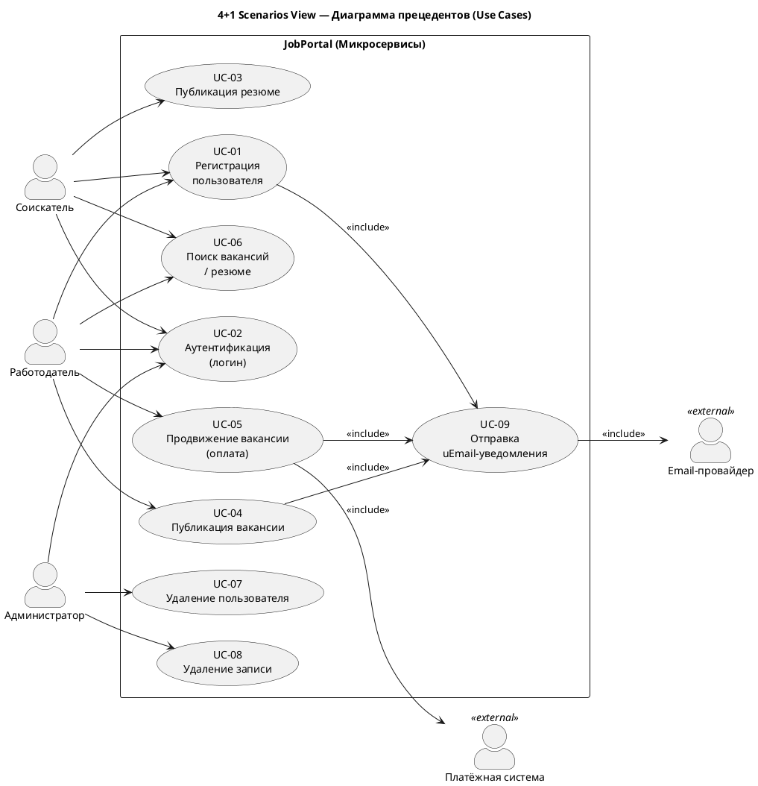

# PlantUML-диаграммы для отчёта ПАПС №8

Каждый блок кода — отдельная диаграмма.  
Вставляй содержимое каждого блока на сайт https://www.plantuml.com/plantuml/uml/ или в Visual Paradigm.

---

## 1. C4 — Диаграмма контекста: СТАРАЯ архитектура (MVC Монолит)

```plantuml
@startuml C4_Context_Old
!include https://raw.githubusercontent.com/plantuml-stdlib/C4-PlantUML/master/C4_Context.puml

LAYOUT_WITH_LEGEND()

title C4 Context — JobPortal (MVC Монолит, Лаб. работа №7)

Person(jobseeker, "Соискатель", "Публикует резюме,\nищет вакансии")
Person(employer, "Работодатель", "Публикует вакансии,\nпродвигает объявления")
Person(admin, "Администратор", "Модерирует контент\nи пользователей")

System(jobportal, "JobPortal (Монолит)", "Единое Java-приложение.\nMVC-архитектура.\nController + Model + Repository\nв одном развёртываемом артефакте.")

System_Ext(smtp, "SMTP-сервер", "Отправка email-уведомлений\nпользователям")
System_Ext(payment, "Платёжная система", "Обработка платежей\nза продвижение вакансий")
SystemDb_Ext(db, "База данных (SQL)", "Единая реляционная БД\nдля всех данных системы")

Rel(jobseeker, jobportal, "Использует", "HTTP")
Rel(employer, jobportal, "Использует", "HTTP")
Rel(admin, jobportal, "Администрирует", "HTTP")
Rel(jobportal, smtp, "Отправляет письма", "SMTP")
Rel(jobportal, payment, "Проводит платежи", "HTTPS/API")
Rel(jobportal, db, "Читает и пишет данные", "JDBC/SQL")

@enduml
```

---

## 2. C4 — Диаграмма контекста: НОВАЯ архитектура (Микросервисы)

```plantuml
@startuml C4_Context_New
!include https://raw.githubusercontent.com/plantuml-stdlib/C4-PlantUML/master/C4_Context.puml

LAYOUT_WITH_LEGEND()

title C4 Context — JobPortal (Микросервисы, Лаб. работа №8)

Person(jobseeker, "Соискатель", "Публикует резюме,\nищет вакансии")
Person(employer, "Работодатель", "Публикует вакансии,\nпродвигает объявления")
Person(admin, "Администратор", "Модерирует контент\nи пользователей")
Person(mobile, "Мобильный пользователь", "Использует мобильное\nприложение платформы")

System(jobportal, "JobPortal (Микросервисы)", "Система из 6 независимых микросервисов.\nКаждый масштабируется и развёртывается\nавтономно. Связь через API Gateway\nи EventBus.")

System_Ext(smtp, "SMTP-провайдер", "Отправка email-уведомлений")
System_Ext(payment, "Платёжный шлюз", "Stripe / ЮКасса.\nОбработка платежей")

Rel(jobseeker, jobportal, "Использует", "HTTPS/REST")
Rel(employer, jobportal, "Использует", "HTTPS/REST")
Rel(admin, jobportal, "Администрирует", "HTTPS/REST")
Rel(mobile, jobportal, "Использует", "HTTPS/REST")
Rel(jobportal, smtp, "Отправляет письма", "SMTP")
Rel(jobportal, payment, "Проводит платежи", "HTTPS/API")

@enduml
```

---

## 3. C4 — Диаграмма контейнеров: СТАРАЯ архитектура (MVC Монолит)

```plantuml
@startuml C4_Container_Old
!include https://raw.githubusercontent.com/plantuml-stdlib/C4-PlantUML/master/C4_Container.puml

LAYOUT_WITH_LEGEND()

title C4 Containers — JobPortal (MVC Монолит, Лаб. работа №7)

Person(user, "Пользователь", "Соискатель, Работодатель\nили Администратор")

System_Boundary(monolith, "JobPortal — Монолитное Java-приложение") {

    Container(controllers, "Controller Layer", "Java",
        "UserController\nRecordController\nAdministratorController\n\nОбрабатывают запросы, координируют\nбизнес-логику")

    Container(models, "Model Layer", "Java",
        "User, UserImpl, UserFactory\nRecord (abstract)\nResumeImpl, VacancyImpl\nRecordFactory (Factory Method)\n\nДоменные объекты и фабрики")

    Container(security, "Security Layer", "Java / BCrypt / AES",
        "SecurityService (interface)\nSecurityServiceImpl\n\nАутентификация, авторизация,\nшифрование данных")

    Container(repositories, "Repository Layer", "Java / JDBC",
        "UserDataRepository\nRecordDataRepository\n\nРабота с базой данных,\nшифрование при хранении")

    Container(services, "Service Layer", "Java / JavaMail",
        "EmailSystem\nPaymentSystem (Singleton)\n\nВнешние интеграции")
}

SystemDb_Ext(db, "Единая SQL БД", "PostgreSQL / MySQL.\nВсе таблицы в одной схеме.")
System_Ext(smtp, "SMTP", "Email-уведомления")
System_Ext(payment_gw, "Платёжная система", "Внешний API")

Rel(user, controllers, "HTTP-запросы", "HTTP")
Rel(controllers, models, "Создаёт / использует")
Rel(controllers, security, "Аутентификация / авторизация")
Rel(controllers, services, "Уведомления, платежи")
Rel(security, repositories, "Получает данные пользователей")
Rel(repositories, db, "CRUD-операции", "JDBC/SQL")
Rel(services, smtp, "Отправка писем", "SMTP")
Rel(services, payment_gw, "Платёж", "HTTPS")

@enduml
```

---

## 4. C4 — Диаграмма контейнеров: НОВАЯ архитектура (Микросервисы)

```plantuml
@startuml C4_Container_New
!include https://raw.githubusercontent.com/plantuml-stdlib/C4-PlantUML/master/C4_Container.puml

LAYOUT_LEFT_RIGHT()
LAYOUT_WITH_LEGEND()

title C4 Containers — JobPortal (Микросервисы, Лаб. работа №8)

Person(user, "Пользователь", "Соискатель, Работодатель,\nАдминистратор")

System_Boundary(jobportal, "JobPortal — Микросервисная система") {

    Container(gateway, "API Gateway", "Java",
        "ApiGateway\n\nЕдиная точка входа.\nМаршрутизация запросов\nк нужному сервису.")

    Container(eventbus, "EventBus", "Java (in-memory)\n/ Kafka в production",
        "Publisher-Subscriber.\nСлабосвязанная коммуникация\nмежду сервисами.\nСобытия: UserRegistered,\nRecordCreated, PaymentCompleted")

    Container(usersvc, "UserService", "Java",
        "UserController\nUserRepository\nmodel.User\n\nРегистрация, профиль\nпользователей")

    Container(recordsvc, "RecordService", "Java",
        "RecordController\nRecordRepository\nJobRecord, VacancyImpl,\nResumeImpl, Factories\n\nВакансии и резюме")

    Container(securitysvc, "SecurityService", "Java / BCrypt / AES / JWT",
        "SecurityService (interface)\nSecurityServiceImpl\n\nАутентификация,\nавторизация, JWT-токены")

    Container(notifysvc, "NotificationService", "Java / JavaMail",
        "NotificationService\n\nПодписан на EventBus.\nОтправляет email при\nрегистрации, создании\nзаписи, оплате")

    Container(paymentsvc, "PaymentService", "Java (Singleton)",
        "PaymentService\n\nОбработка платежей.\nПубликует PaymentCompleted\nв EventBus")

    Container(adminsvc, "AdminService", "Java",
        "AdminController\n\nУдаление пользователей\nи записей. Требует\nроль ADMIN")

    ContainerDb(usersdb, "Users DB", "PostgreSQL",
        "Таблицы: users, security_log.\nЗашифрованные данные.")

    ContainerDb(recordsdb, "Records DB", "PostgreSQL",
        "Таблицы: records.\nВакансии и резюме.")
}

System_Ext(smtp, "SMTP-провайдер", "Внешний email-сервис")
System_Ext(payment_gw, "Платёжный шлюз", "Stripe / ЮКасса")

Rel(user, gateway, "HTTP-запросы", "HTTPS/REST")
Rel(gateway, usersvc, "POST /auth/*", "internal")
Rel(gateway, recordsvc, "POST /records", "internal")
Rel(gateway, adminsvc, "DELETE /admin/*", "internal")
Rel(gateway, securitysvc, "Проверка токена", "internal")

Rel(usersvc, securitysvc, "registerUser / authenticate")
Rel(usersvc, usersdb, "CRUD", "JDBC")

Rel(recordsvc, recordsdb, "CRUD", "JDBC")
Rel(recordsvc, securitysvc, "authorizeAction")

Rel(adminsvc, usersvc, "deleteUser")
Rel(adminsvc, recordsvc, "deleteRecord")
Rel(adminsvc, securitysvc, "authorizeAction")

Rel(securitysvc, eventbus, "publish(UserRegisteredEvent)")
Rel(recordsvc, eventbus, "publish(RecordCreatedEvent)")
Rel(paymentsvc, eventbus, "publish(PaymentCompletedEvent)")

Rel(notifysvc, eventbus, "subscribe(все события)", "async")
Rel(notifysvc, smtp, "sendEmail()", "SMTP")
Rel(paymentsvc, payment_gw, "processPayment()", "HTTPS")

@enduml
```

---

## 5. 4+1 — Логическая перспектива (Class Diagram)

```plantuml
@startuml Logical_View
skinparam classAttributeIconSize 0
skinparam packageStyle rectangle
skinparam linetype ortho

title 4+1 Logical View — Диаграмма классов (Микросервисы)

package "events" #LightYellow {
    abstract class Event {
        - eventId: String
        - occurredAt: Instant
        + getEventType(): String
    }
    interface EventHandler<T extends Event> {
        + handle(event: T): void
    }
    class EventBus {
        - instance: EventBus {static}
        - handlers: Map<String, List<EventHandler>>
        + getInstance(): EventBus {static}
        + subscribe(eventType: String, handler: EventHandler): void
        + publish(event: Event): void
    }
    class UserRegisteredEvent extends Event {
        - userId: String
        - email: String
        - role: String
        + getEventType(): String
    }
    class RecordCreatedEvent extends Event {
        - recordId: String
        - ownerId: String
        - recordType: String
        + getEventType(): String
    }
    class PaymentCompletedEvent extends Event {
        - userId: String
        - recordId: String
        - amount: double
        + getEventType(): String
    }
}

package "gateway" #LightBlue {
    class ApiGateway {
        - userController: UserController
        - recordController: RecordController
        - adminController: AdminController
        + handleLogin(email, password): String
        + handleRegister(email, password, role): String
        + handleCreateRecord(userId, ...): void
        + handleDeleteUser(adminId, targetId): void
    }
}

package "userservice" #LightGreen {
    class UserController {
        - securityService: SecurityService
        + login(email, password): String
        + register(email, password, role): String
        + canAccessResource(userId, role): boolean
    }
    class User {
        - id: String
        - encryptedEmail: String
        - encryptedPasswordHash: String
        - encryptedRole: String
    }
    class UserRepository {
        - connection: Connection
        + save(user: User): void
        + findById(userId: String): User
        + findByEmail(email: String): User
        + deleteById(userId: String): void
        + logSecurityEvent(...): void
    }
}

package "recordservice" #LightCoral {
    class RecordController {
        - recordFactory: RecordFactory
        - recordRepository: RecordRepository
        - securityService: SecurityService
        - eventBus: EventBus
        + registerRecord(userId, ...): void
        + promoteRecord(userId, record): void
    }
    abstract class JobRecord {
        - id: String
        - nonSpecificData: Object
    }
    abstract class RecordFactory {
        + createRecord(nonSpecific, specific): JobRecord
        # getRecordWithNonSpecificData(data): JobRecord
        # getRecordWithSpecificData(record, data): JobRecord
    }
    interface IVacancy {
        + setVacancySpecificData(data): void
    }
    interface IResume {
        + setResumeSpecificData(data): void
    }
    class VacancyImpl extends JobRecord implements IVacancy
    class ResumeImpl extends JobRecord implements IResume
    class VacancyFactoryImpl extends RecordFactory
    class ResumeFactoryImpl extends RecordFactory
    class RecordRepository {
        - connection: Connection
        + insertRecord(record: JobRecord): void
        + updateRecord(record: JobRecord): void
        + deleteRecord(recordId: String): void
    }
}

package "securityservice" #Lavender {
    interface SecurityService {
        + hasRole(userId, role): boolean
        + authenticate(email, password): String
        + registerUser(email, password, role): String
        + authorizeAction(userId, requiredRole): boolean
    }
    class SecurityServiceImpl implements SecurityService {
        - userRepository: UserRepository
        - eventBus: EventBus
        - SECRET_KEY: String {static}
        + authenticate(email, password): String
        + registerUser(email, password, role): String
        # encrypt(data): String
        # decrypt(data): String
        # generateToken(userId): String
    }
}

package "notificationservice" #PeachPuff {
    class NotificationService {
        - eventBus: EventBus
        + sendEmail(to, subject, text): void
        - subscribeToEvents(): void
    }
}

package "paymentservice" #Wheat {
    class PaymentService {
        - instance: PaymentService {static}
        - eventBus: EventBus
        + getInstance(eventBus): PaymentService {static}
        + processPayment(userId, recordId, amount): boolean
        - callExternalPaymentProvider(...): boolean
    }
}

package "adminservice" #LightGray {
    class AdminController {
        - userRepository: UserRepository
        - recordRepository: RecordRepository
        - securityService: SecurityService
        + deleteUser(adminId, targetId): void
        + deleteRecord(adminId, recordId): void
    }
}

' Связи
ApiGateway --> UserController
ApiGateway --> RecordController
ApiGateway --> AdminController

UserController --> SecurityService
SecurityServiceImpl --> UserRepository
SecurityServiceImpl --> EventBus

RecordController --> RecordFactory
RecordController --> RecordRepository
RecordController --> SecurityService
RecordController --> EventBus

AdminController --> UserRepository
AdminController --> RecordRepository
AdminController --> SecurityService

NotificationService --> EventBus
PaymentService --> EventBus

EventBus --> EventHandler

@enduml
```



---

## 6. 4+1 — Перспектива процессов: Регистрация пользователя (Sequence)



---

## 7. 4+1 — Перспектива процессов: Продвижение вакансии (Sequence)



---

## 8. 4+1 — Перспектива разработки (Component Diagram)



---

## 9. 4+1 — Физическая перспектива (Deployment Diagram)



---

## 10. 4+1 — Сценарии / Use Cases (+1)



---

## Итого: список диаграмм

| № | Название | Раздел отчёта |
|---|----------|---------------|
| 1 | C4 Context — Старая архитектура | C4, раздел 5.1 |
| 2 | C4 Context — Новая архитектура | C4, раздел 5.1 |
| 3 | C4 Containers — Старая архитектура | C4, раздел 5.2 |
| 4 | C4 Containers — Новая архитектура | C4, раздел 5.2 |
| 5 | Class Diagram (Logical View) | 4+1, раздел 6.1 |
| 6 | Sequence: Регистрация (Process View) | 4+1, раздел 6.2 |
| 7 | Sequence: Продвижение вакансии (Process View) | 4+1, раздел 6.2 |
| 8 | Component Diagram (Development View) | 4+1, раздел 6.3 |
| 9 | Deployment Diagram (Physical View) | 4+1, раздел 6.4 |
| 10 | Use Case Diagram (Scenarios +1) | 4+1, раздел 6.5 |
